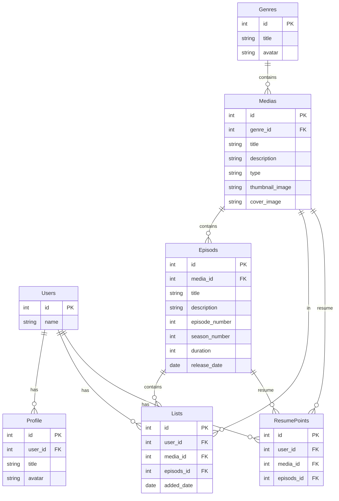

# Tables

- **Genres**
  - id
  - title
  - avatar
- **Medias**
  - id
  - genre_id
  - title
  - description
  - type
    - dizi
    - film
  - thumbnail_image
  - cover_image
- **Episods**
  - id
  - media_id
  - title
  - description
  - episode_number
  - season_number
  - duration
  - release_date
- **Profile**
  - id
  - user_id
  - title
  - avatar
  - is_default
- **Lists**
  - id
  - user_id
  - media_id
  - episods_id
  - added_date
- **ResumePoints**
  - id
  - user_id
  - media_id
  - episods_id

# Starflix Db Schema

